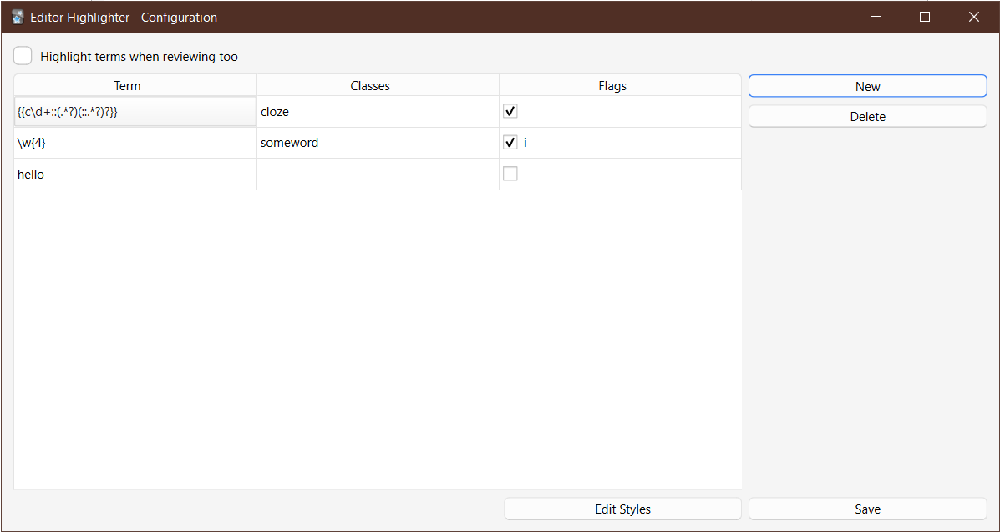

# Editor Highlighter

This add-on allows you to highlights any specified terms/patterns in the editor and (optionally) review/preview screen.

The default config highlights clozes in blue.

See _Tools > Add-ons > Config_ for configuration.

You can add new terms via the _New_ button, delete the selected row via _Delete_, and edit terms by double clicking on them.

By default, the add-on highlights terms in blue, but you specify a different color or even different styles such as bold, italic and underline, by clicking on _Edit Styles_, which will open a CSS file.

You can also give different terms different styles by specifying custom CSS classes under the _Classes_ column.

If you're technical enough, you can also tell the add-on to treat terms as [regex](https://www.rexegg.com/) patterns by checking in the checkbox under the _Flags_ column. Here you can also specify flags such as `i` to match text in a case-insensitive manner.

By default, the add-on only highlights terms in the editor, but you can change it by checking the _Highlight terms when reviewing too_ option.

## Known Issues

-   Sometimes the cursor jumps around to the previous word or the beginning of the field while the add-on highlights terms as they're typed.

## Changelog

See [CHANGELOG.md](CHANGELOG.md) for a list of changes.

## Support & feature requests

Please post any questions, bug reports, or feature requests in the [support page](https://forums.ankiweb.net/c/add-ons/11) or the [issue tracker](https://github.com/abdnh/anki-editor-highlighter/issues).

If you want priority support for your feature/help request, I'm available for hire.
You can get in touch from the aforementioned pages, via [email](mailto:abdo@abdnh.net) or on [Fiverr](https://www.fiverr.com/abd_nh).

## Support me

Consider supporting me if you like my work:

I'm also available for freelance add-on development on Fiverr:

